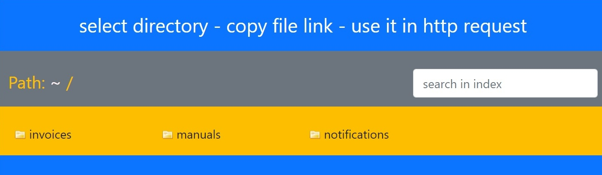

# Serve Files - Show Directories

Serve files and shows directory index of a given directory and its subdirectories.



Just mount your data **read only** and assign a free port. Then use a browser to select any file, copy the link and insert that link into any other application. You can traverse through directories or search files (in viewed directory)

## Security

The container does not change any data or permissions of the served files/directories and supports read-only mounted volumes.

A user "node" with UID=1000 and group node with GID=1000 is available inside the container.

To run Node.js as non-root you can specify a UID. This user is being created inside the container, added to group "node" (in case UID=1000 the existing user is used) and being used to start Node.js
Be aware that some installations (such as Synology NAS) per default may not allow access to files except for the owner of the file. In that case you should specify the UID of the owner of the mounted files.

The image is based on serve-index, standard Node.js 17 alpine image, Bootstrap 5 and should only be used in a local network (http).

## My Use Case

My Synology NAS acts as primary data server for multimedia, videos but also invoices, manuals and notification. `server-files-plus` is installed on Synology Docker and makes the data available to other applications supporting http links (in my case Node-RED, grocy).

## Test and Permissions

Tested on Synology NAS for mp3 files (notifications), pdf, jpg, png, odt (documents) files.

The message "internal server error" may occur if the permission of a file does not allow read access.

## Docker command

Example: Mounted read only and UID set to owner (1026) of the files being served:

```Docker
 sudo docker run -itd \
-p "8080:3000" \
-v "/volume1/MultiMedia/others:/opt/public:ro" \
-e "UID=1026" \
-e "COL=4" \
--name serve-files-plus \
serve-files-plus/latest
```

Be aware that only /bin/sh is supported in Node.js alpine based images.

## Exposes

- Port 3000
- Data mount point (Volume): /opt/public
- ENV CONTENT_DIRECTORY: mount point, default is /opt/public
- ENV COL: the number of columns in directory listing, with default 4
- ENV UID: the uid of the owner of the data at the host

## Internal setup

- code location: /opt/serve-files-plus/src
- Official Node.js image based on alpine
