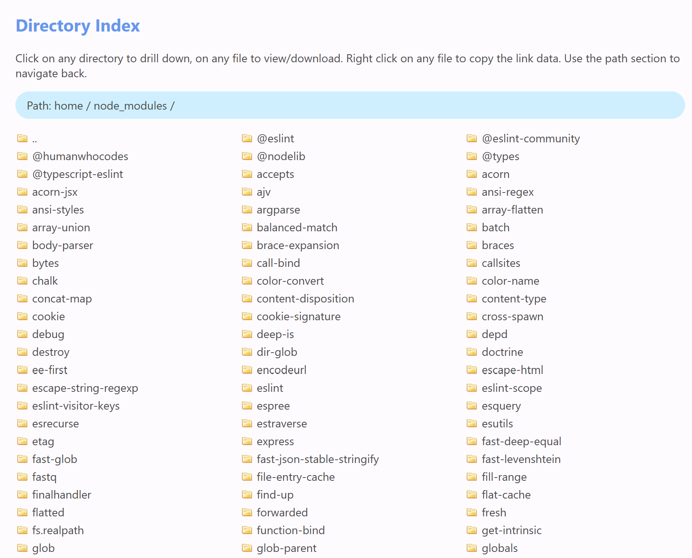

## Serve Files Plus

Use any web browser to view the index of a given directory. Click on any sub-directory to drill down, on any file to view/download. Right click on any file to copy the link data. Use the path section to navigate back.The page uses the full size and displays as many columns as possible (responsive design).

Just mount your data **read only** to `/opt/public`, provide the uid of the owner of the data and assign a free port.



### Security

The Docker container does not change any data or permissions of the served files/directories and supports read-only (recommended) mounted volumes. A user "node" with UID=1000 and group node with GID=1000 is available inside the container (a feature of the NodeJS alpine container).

Be aware that some hosts only allow owners (and root) of a mounted volumes to access the data.To run Node.js as non-root and be able to access the data you may specify a UID. A user 'usrx' with that uid is being created and added to group `node`.

The image is based on standard alpine NodeJS image and includes serve-index. It should only be used in a local network (http).

### My Use Case

My Synology NAS acts as primary data server for multimedia, videos and invoices, manuals and notification. `server-files-plus` is installed on Synology Docker and makes the data available to other applications supporting http links (in my case Node-RED, grocy).

### Test and Permissions

Tested on Synology NAS for mp3 files (notifications), pdf, jpg, png, odt (documents) files.

The message "internal server error" may occur if the permission of a file does not allow read access.

### Docker command

Example: Mounted read only and UID set to owner (1026) of the files being served:

```Docker
 sudo docker run -itd \
-v "/volume1/MultiMedia/others:/opt/public:ro" \
-e "UID=1026" \
-p "8080:3000" \
--name serve-files-plus \
serve-files-plus/latest
```

Be aware that only /bin/sh is supported in Node.js alpine based images (feature of NodeJS alpine image)

### Exposes

- Port 3000
- Data mount point (Volume): /opt/public
- ENV CONTENT_DIRECTORY: mount point, default is /opt/public
- ENV UID: the uid of the owner of the data at the host

### Internal setup

- code location: /opt/serve-files-plus/src
- Official Node.js image based on alpine
